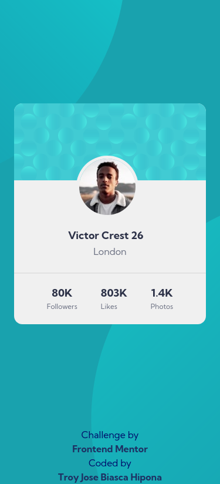
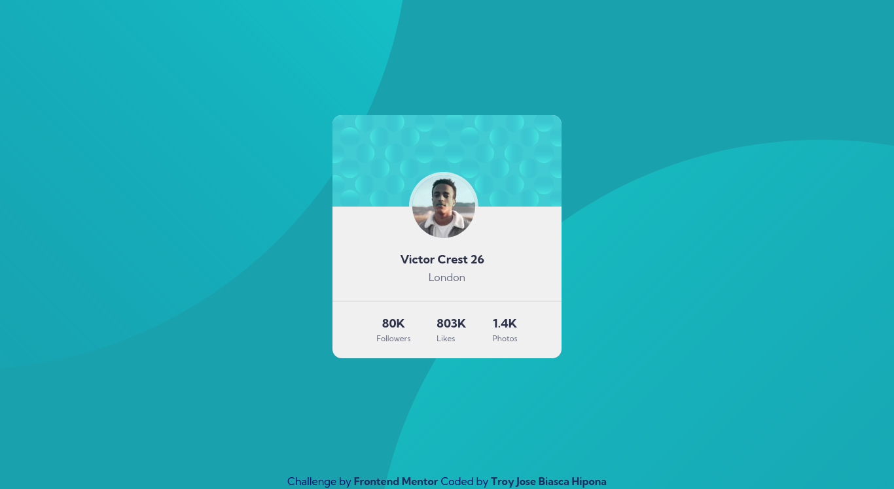

# Frontend Mentor - Profile card component solution

This is a solution to the [Profile card component challenge on Frontend Mentor](https://www.frontendmentor.io/challenges/profile-card-component-cfArpWshJ). Frontend Mentor challenges help you improve your coding skills by building realistic projects. 

## Table of contents

- [Overview](#overview)
  - [The challenge](#the-challenge)
  - [Screenshot](#screenshot)
  - [Links](#links)
- [My process](#my-process)
  - [Built with](#built-with)
  - [What I learned](#what-i-learned)
  - [Useful resources](#useful-resources)
- [Author](#author)
- [Acknowledgments](#acknowledgments)

## Overview

This is a perfect challenge to test your layout skills. The card layout doesn't shift, so it's also great for those that haven't dived into responsive websites yet!

### The challenge

- Build out the project to the designs provided

### Screenshot

### Links

- Solution URL: [Add solution URL here](https://github.com/troy03/profile-card-component)
- Live Site URL: [Add live site URL here](https://profile-card-component-troy03.netlify.app/)

## My process

  My process was to note what I'm going to  study it includes positioning in background images and restudy a  flexbox

### Built with

- Semantic HTML5 markup
- CSS custom properties
- Flexbox
-BEM Methodology
-SCSS
- Mobile-first workflow

### What I learned

I learn about positioning an images to a hero background and improve more on SCSS skills

### Useful resources

- [CSS Tricks](https://css-tricks.com/snippets/sass/mixin-manage-breakpoints/) - This help me for Mixin in terms of breakpoints in different devices

## Author
- Github - [@troy03](https://github.com/troy03)

## Acknowledgments

Thank you for all frontendmentor community to motivate me in my web development journey.
